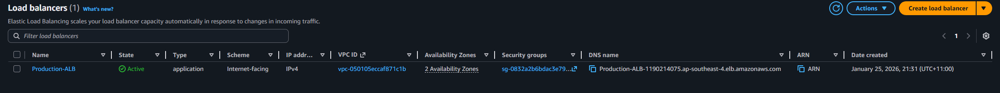
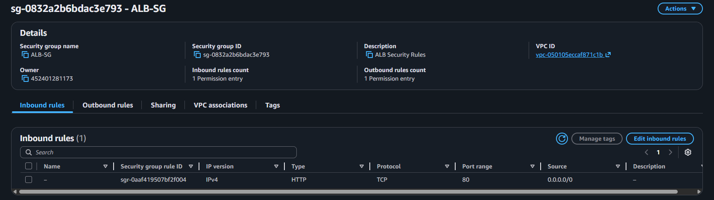
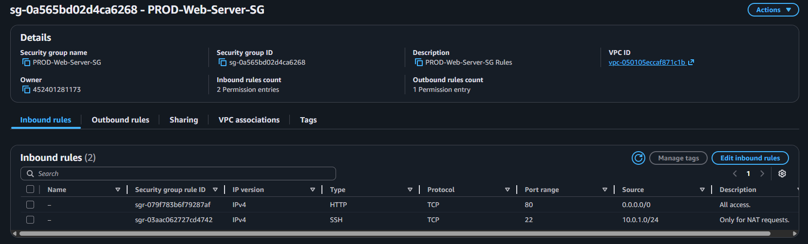
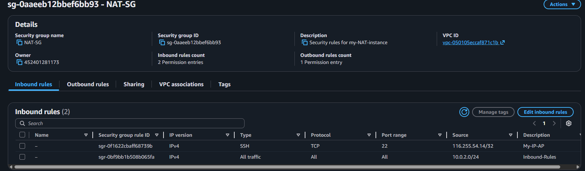
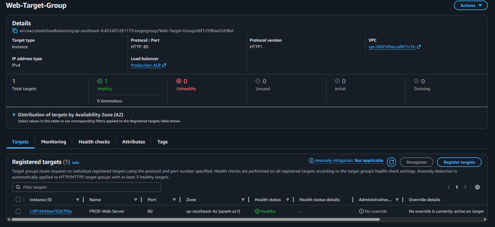
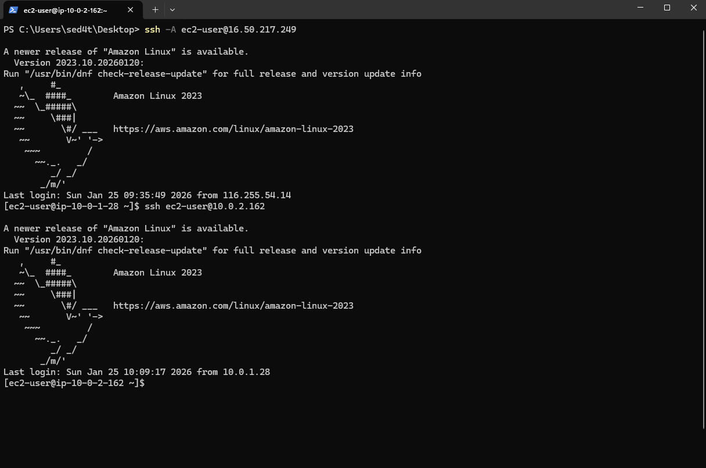
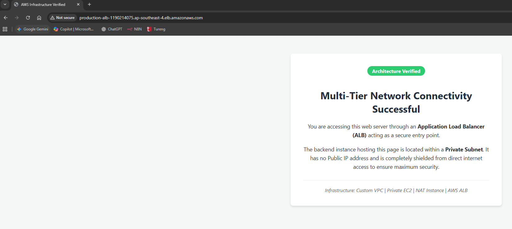

# AWS Multi-Tier Secure Network Architecture

## Project Overview
The primary objective of this project is to implement a robust and secure network environment on AWS that follows the principle of least privilege. In a standard single-tier architecture, web servers are often exposed directly to the internet, creating a significant attack surface. This project solves that problem by placing the application layer in a completely isolated Private Subnet. Traffic is managed through a managed Application Load Balancer, while outbound connectivity for system updates is handled by a custom NAT Instance.

## Architecture Design
The architecture is built within a custom Virtual Private Cloud (VPC) using the 10.0.0.0/16 CIDR block. The design is split into two distinct layers: Public Layer and Private Layer. The Public Layer contains the Application Load Balancer and the NAT Instance, which are the only components with a public footprint. The Private Layer contains the Apache Web Server, which has no public IP address and cannot be reached directly from the internet.

## Infrastructure Status and Resource Management
The resources were deployed across multiple Availability Zones to ensure high availability. The management of these instances required careful coordination of IP addressing and network routing tables to ensure the private instance could communicate with the NAT instance for internet-bound traffic.

## Security Group Chaining and Traffic Control
The core of this project security lies in Security Group Chaining. Instead of allowing traffic based on broad IP ranges, the security groups are linked to each other. This ensures that even if an unauthorized user knows the private IP of the server, they cannot communicate with it unless they are coming through the approved load balancer or the management gateway.

## Application Load Balancer Security
The ALB acts as the front door. It is configured to accept standard HTTP traffic on port 80 from any source. Its primary role is to receive requests and forward them to the healthy targets in the private subnet.

## Web Server Security Isolation
The Web Server is the most protected asset. Its security group is configured with strict rules. It only accepts traffic if the source is the ALB Security Group ID and it only accepts management traffic if the source is the NAT Instance Security Group ID.

## Management Gateway (NAT Instance) Security
The NAT Instance serves a dual purpose: it acts as a NAT gateway for the private server outbound requests and as a Bastion Host for administrative access. Its security group is restricted to only allow SSH access from the administrator's specific public IP address.

## Connectivity and Deployment Verification

### Load Balancer Target Health
A critical component of a multi-tier system is the health check mechanism. The ALB constantly performs heartbeats to the private web server. If the server fails to respond on port 80, the ALB will stop sending traffic to it. The following screenshot confirms that the private instance is correctly registered and passing these health checks.

### Administrative Access via SSH Agent Forwarding
Since the web server is in a private subnet, direct SSH is impossible. I utilized SSH Agent Forwarding, allowing me to connect to the NAT Instance and then jump to the Web Server using my local private key without ever uploading that key to the cloud. This maintains the integrity of the security credentials.

### Final Infrastructure Validation
The ultimate proof of the architecture success is the live web response. By navigating to the DNS name provided by the ALB, we can see the professional landing page served by the private EC2 instance. This confirms that the entire chain from the internet gateway to the load balancer and finally to the private subnet is functioning as intended.

# System Definition and General Summary

The AWS Multi-Tier Secure Network Architecture is a professional-grade cloud infrastructure built on the core principles of Defense in Depth and Least Privilege. Unlike traditional flat network designs, this architecture physically and logically segregates application components based on their roles and risk profiles. The system is partitioned into two distinct zones: a Public Layer for edge-facing services and a Private Layer for isolated backend processing.

## 1. Layered Defense and Isolation

The heart of the system—the Apache Web Server—is housed within a Private Subnet with no direct route to or from the internet. This effectively removes the server from the public attack surface, making it immune to direct internet-based scans or brute-force attempts. All incoming legitimate traffic is strictly brokered by a managed Application Load Balancer (ALB) acting as a secure gateway.

## 2. Dynamic Security Group Chaining

Security is enforced through Security Group Chaining rather than static IP filtering. By referencing the Security Group IDs of the ALB and the NAT Instance, the web server maintains a dynamic trust relationship. It only accepts traffic if it originates from these specific, authorized entities, ensuring that even internal lateral movement is restricted.

## 3. Secure Administration and Outbound Control

NAT Instance: Facilitates secure outbound connectivity for the private instances, allowing for critical system patches and updates without exposing the instances to inbound risks.

Bastion Host & SSH Agent Forwarding: Administrative access is achieved through a secure "Jump Server" methodology. By utilizing SSH Agent Forwarding, management tasks are performed without ever storing sensitive private keys on the cloud infrastructure, maintaining credential integrity.

# Final Conclusion

This project demonstrates a transition from simple cloud hosting to a security-first infrastructure design. By integrating Invisibility, Strict Access Control, and High Availability, the architecture minimizes the potential blast radius of any security incident. It serves as a robust blueprint for hosting sensitive workloads where the protection of data and the reduction of the attack surface are the primary objectives.
