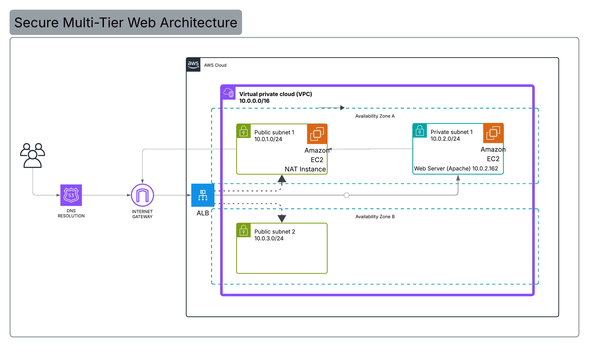
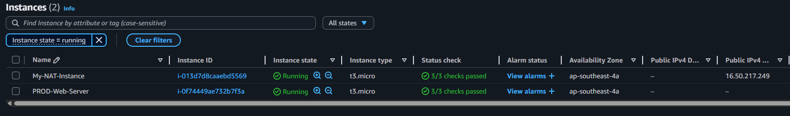
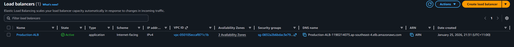
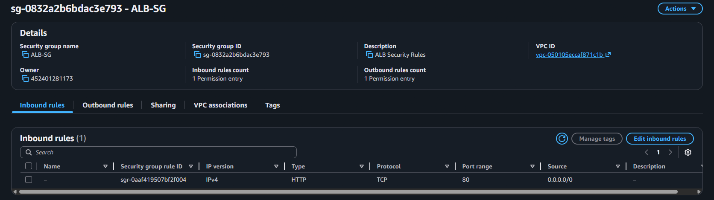
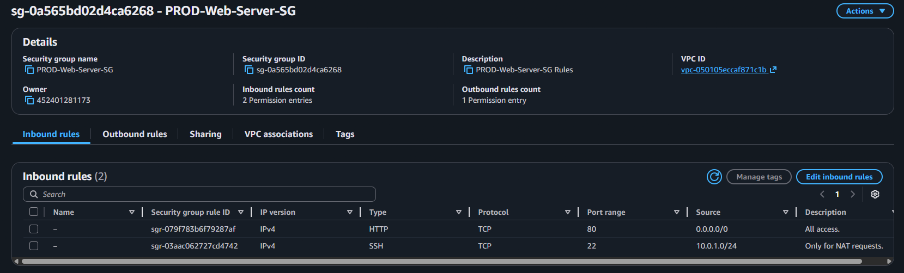
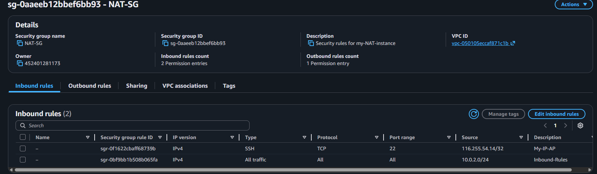
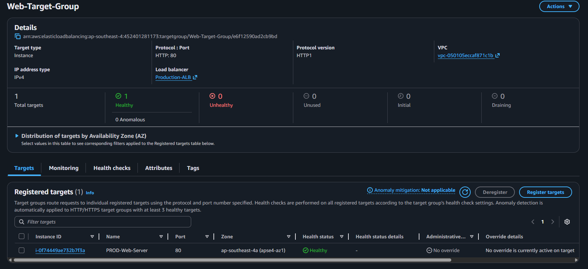
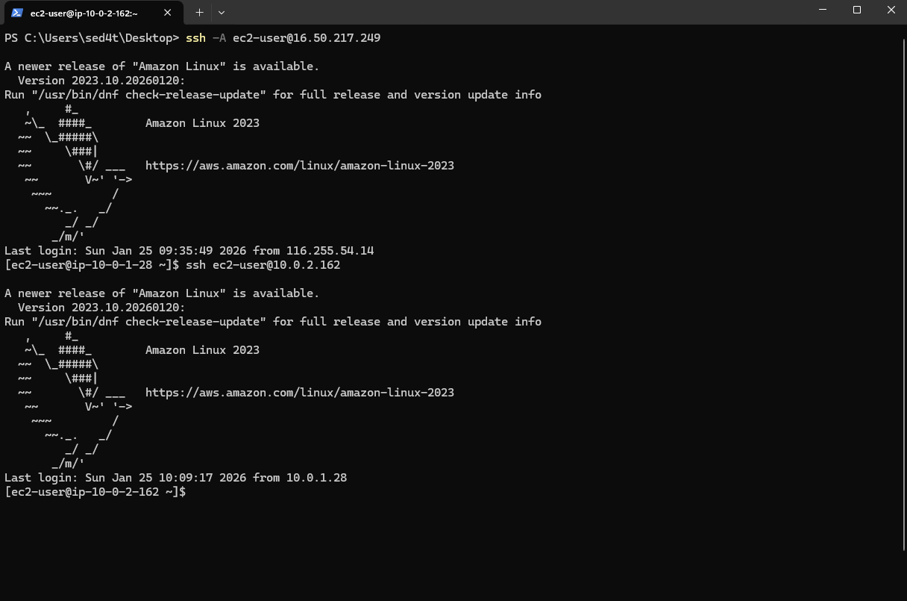
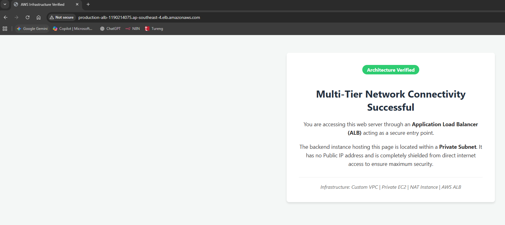

# Secure VPC Architecture — AWS Multi-Tier Network Design

> A production-grade cloud infrastructure built on Defense in Depth and Least Privilege principles, isolating application workloads in private subnets behind managed load balancing and security group chaining.

[](https://aws.amazon.com/)
[](https://aws.amazon.com/vpc/)
[](https://aws.amazon.com/elasticloadbalancing/)
[]()

---

## Overview

In a standard single-tier architecture, web servers are exposed directly to the internet — creating a massive attack surface. This project eliminates that risk by placing the application layer in a completely isolated **Private Subnet** with zero public footprint.

Traffic flows exclusively through a managed **Application Load Balancer**, while outbound connectivity for system updates is handled through a custom **NAT Instance** that doubles as a bastion host.

## Architecture



```
                        ┌─────────────────────────────────────────┐
                        │           Custom VPC (10.0.0.0/16)      │
                        │                                         │
  Internet ─────►  ┌────┴──────── PUBLIC SUBNET ──────────────┐   │
                   │                                           │   │
                   │  ┌─────────┐         ┌───────────────┐   │   │
                   │  │   ALB   │         │ NAT Instance  │   │   │
                   │  │ (HTTP)  │         │ (Bastion/NAT) │   │   │
                   │  └────┬────┘         └───────┬───────┘   │   │
                   └───────┼──────────────────────┼───────────┘   │
                           │ SG Chain             │ SG Chain      │
                   ┌───────┼──────────────────────┼───────────┐   │
                   │       ▼                      ▼           │   │
                   │  ┌──────────────────────────────────┐    │   │
                   │  │     Apache Web Server (Private)  │    │   │
                   │  │     No Public IP — Invisible      │    │   │
                   │  └──────────────────────────────────┘    │   │
                   │         PRIVATE SUBNET                   │   │
                   └──────────────────────────────────────────┘   │
                        └─────────────────────────────────────────┘
```

## Security Model

### Security Group Chaining

Instead of allowing traffic based on broad IP ranges, security groups reference each other by **Security Group ID**. This creates a dynamic trust chain:

| Component | Inbound Rule | Source |
|-----------|-------------|--------|
| **ALB** | HTTP (80) | `0.0.0.0/0` (internet) |
| **Web Server** | HTTP (80) | ALB Security Group ID |
| **Web Server** | SSH (22) | NAT Instance Security Group ID |
| **NAT Instance** | SSH (22) | Admin's specific public IP only |

Even if an attacker discovers the private server's IP, they **cannot communicate with it** unless traffic originates from an authorized security group.

### Key Security Properties

- **Invisibility:** Web server has no public IP — removed from the internet attack surface entirely
- **Strict Access Control:** Security group chaining enforces entity-based (not IP-based) trust
- **Credential Integrity:** SSH Agent Forwarding enables administration without uploading keys to the cloud
- **High Availability:** Resources deployed across multiple Availability Zones

## Infrastructure Components

| Layer | Component | Role |
|-------|-----------|------|
| **Public** | Application Load Balancer | Front door — accepts HTTP, routes to healthy targets |
| **Public** | NAT Instance | Dual-purpose: outbound NAT + SSH bastion host |
| **Private** | Apache Web Server | Application layer — zero internet exposure |

## Verification Screenshots

| Verification | Screenshot |
|-------------|-----------|
| Infrastructure Instances |  |
| ALB Configuration |  |
| ALB Security Group |  |
| Web Server Security Group |  |
| NAT Instance Security Group |  |
| ALB Target Health Check |  |
| SSH Agent Forwarding Access |  |
| Live Web Page Validation |  |

## Administration

Administrative access follows a secure jump-server methodology:

```bash
# SSH Agent Forwarding — private key never leaves local machine
ssh-add ~/.ssh/your-key.pem
ssh -A ec2-user@<NAT_PUBLIC_IP>

# From NAT Instance, jump to private web server
ssh ec2-user@<WEB_SERVER_PRIVATE_IP>
```

## Key Takeaways

This project demonstrates the transition from simple cloud hosting to **security-first infrastructure design**. By integrating invisibility, strict access control, and high availability, the architecture minimizes the blast radius of any potential security incident — serving as a blueprint for hosting sensitive workloads where data protection and attack surface reduction are the primary objectives.

## Contact

GitHub: [sedat4ras](https://github.com/sedat4ras) | Email: sudo@sedataras.com
